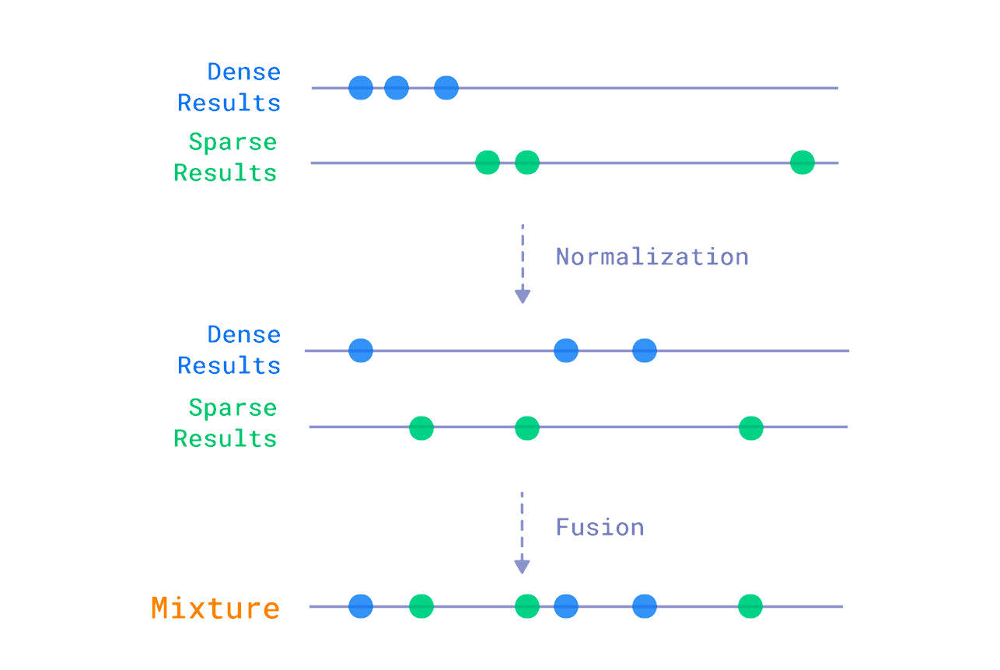

# Legal Chatbot

## Overview
_____
The Legal Chatbot system is an innovative tool that provides fast and accurate legal information and assistance. Its goal is to bridge the gap between users and legal experts. Using the latest techniques, including LangGraph and intelligent agents, the Legal Chatbot helps users search for legal information and receive legal answers efficiently, while also providing guidance tailored to each legal situation.

## Features
_____
- **Interactive Interface**: Engage with a conversational AI designed to understand and respond to legal questions.
- **Legal Resource Library**: Access a comprehensive database of legal documents, statutes, and case law.
- **Privacy and Security**: Ensure your interactions are secure and confidential, adhering to the highest standards of data protection.

## Getting Started
_____
1. **Installation**: Clone this repository to your local machine using `git clone https://github.com/ictumuk/Legal_Chatbot.git`.
2. **Dependencies**: Install all required dependencies by running `pip install -r requirements.txt`, depending on the project's technology stack.
3. **Setup Data**: Initialize the data by running the following Python script: `python initialize_data.py`.

## Model Used
_____
- **Dense Embedding Model**: dangvantuan/vietnamese-embedding, available on Hugging Face (https://huggingface.co/dangvantuan/vietnamese-document-embedding). This model is specialized in processing Vietnamese text embeddings, allowing the chatbot to understand and analyze document content.

- **Sparse Embedding Model**: Qdrant/bm25. This model utilizes the BM25 technique, commonly used in search systems to enhance document retrieval and classification, particularly in the context of legal documents.

- **Generative Model**: llama-3.1-70b-versatile, implemented via the [Chat Groq API](https://groq.com/). This model is capable of generating flexible and natural responses based on user queries or requests, with powerful applications in content creation, explanations, and legal consulting.

## Tools use
_____
- **Retrieval**: Hybrid Search is a powerful technique that combines search results from different methods, helping to improve the accuracy and efficiency of search results. By using RRF, the search system can optimize the combination of keyword search and semantic search, providing more accurate results. (https://qdrant.tech/articles/hybrid-search/).

- **Websearch**: Tavily Search API is a search engine optimized for LLMs, aimed at efficient, quick and persistent search results. Unlike other search APIs such as Serp or Google, Tavily focuses on optimizing search for AI developers and autonomous AI agents. We take care of all the burden of searching, scraping, filtering and extracting the most relevant information from online sources. All in a single API call!(https://docs.tavily.com/docs/welcome).

## Command-Line Arguments
_____
The script accepts the following command-line arguments:

* `--query`: The query or question to be processed by the chatbot.
* `--chat_mode`: The mode in which the chatbot should operate. Can be one of `CRAG`, `RAG`, or `REACT`.
* `--question_type`: The type of question being asked (e.g. `Đúng/Sai`, `Tự luận`,`Trắc nghiệm`).

Example usage:
```bash
python main.py --query "Việc bán ngôi nhà duy nhất vợ chồng đang ở có thể được thực hiện chỉ cần có sự đồng ý của chồng mà không cần sự đồng ý của vợ, đúng hay sai?" --chat_mode CRAG --question_type "Đúng/Sai"